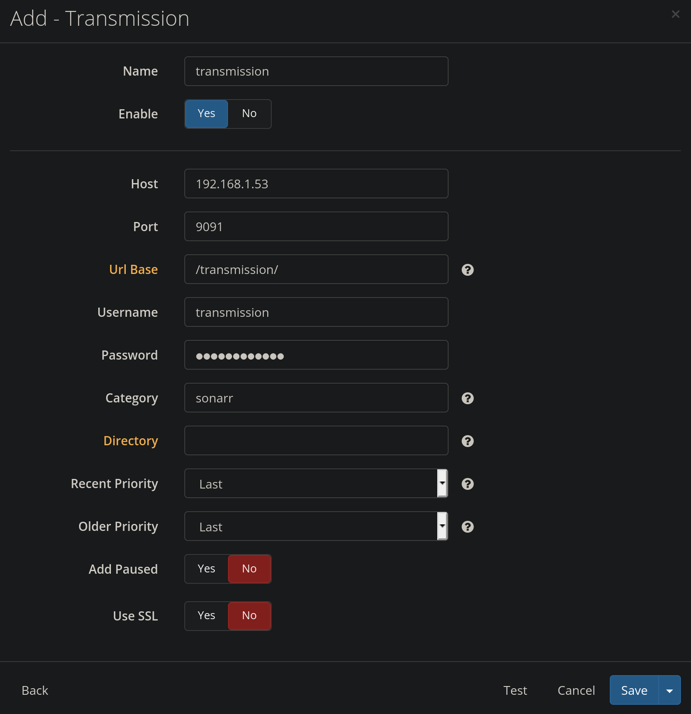

# Archlinux for Odroid C2 has been dismissed

I suggest you move to another OS

You can still use this repo for the docker container used for a home-made media server


## Arch linux installation on odroid C2

> NOTE: Do everything with root, not sudo

Read the [Arch Installation
Guide](https://archlinuxarm.org/platforms/armv8/amlogic/odroid-c2)

## change default password

```shell
$ passwd root
$ passwd alarm
```

## install packages

```shell
$ pacman -S bash-completion vim
$ usermod -a -G wheel,storage,power,network,uucp <username>
$ EDITOR=nvim visudo
--------------------------------------------------------------------------------

...

%wheel ALL=(ALL) ALL

...
```

--------------------------------------------------------------------------------
Installation process ends here, next step are optional
--------------------------------------------------------------------------------

### configure ntpd

```shell
$ pacman -S ntp
$ systemctl enable ntpd.service
$ reboot
```

### static IP

Replace `eth0` with your network card’s name
```shell
$ nvim /etc/systemd/network/eth0.network
--------------------------------------------------------------------------------

...

[Match]
Name=eth0

[Network]
Address=192.168.1.XX
Gateway=192.168.1.1
DNS=8.8.8.8
DNS=8.8.4.4

...
```

```shell
$ systemctl disable netctl@eth*.service
$ pacman -Rns netctl
$ systemctl stop dhcpcd
$ systemctl disable dhcpcd
$ systemctl enable systemd-networkd
$ systemctl start systemd-networkd
$ reboot
```

> [Reference](https://www.ostechnix.com/configure-static-dynamic-ip-address-arch-linux/)
> `systemd` method

## automount external device

```shell
$ pacman -S ntfs-3g
$ nvim /etc/fstab
--------------------------------------------------------------------------------

...

/dev/sda1   /mnt/storage    ntfs-3g uid=1000,gid=1000,permissions,local=en_US.utf8   0   2

...
```

## vpn

```shell
$ pacman -S openvpn openssl easy-rsa
```

- [working script](https://github.com/angristan/openvpn-install)

## install docker

```shell
$ sudo pacman -S docker
$ systemctl enable docker
$ systemctl start docker
```

--------------------------------------------------------------------------------
MAY BE DEPRECATED SINCE I NOW USE `docker-compose.yml`
--------------------------------------------------------------------------------

### install portainer

[Reference](https://www.portainer.io/installation/)

```
docker volume create portainer_data

docker run -d \
    --name=portainer \
    -p 8000:8000 \
    -p 9000:9000 \
    --restart=always \
    -v /var/run/docker.sock:/var/run/docker.sock \
    -v portainer_data:/data portainer/portainer
```

See [this](https://fleet.linuxserver.io/) for useful docker


### installation order

#### watchtower

This will update all your docker automatically
```
docker run -d \
    --name watchtower \
    -v /var/run/docker.sock:/var/run/docker.sock \
    containrrr/watchtower:latest --cleanup --debug --interval 1
```

#### transmission

Simply install the docker via command, remember to change path accordingly
```
docker create \
  --name=transmission \
  -e PUID=1000 \
  -e PGID=1000 \
  -e TZ=Europe/Rome \
  -p 9091:9091 \
  -p 51413:51413 \
  -p 51413:51413/udp \
  -v /mnt/storage/docker-config/transmission:/config \
  -v /mnt/storage/download:/downloads \
  -v /mnt/storage/download/toWatch:/watch \
  --restart unless-stopped \
  linuxserver/transmission
```

#### jackett

Simply install the docker via command, remember to change path accordingly
```
docker create \
  --name=jackett \
  -e PUID=1000 \
  -e PGID=1000 \
  -e TZ=Europe/Rome \
  -p 9117:9117 \
  -v /mnt/storage/docker-config/jackett:/config \
  -v /mnt/storage/download:/downloads \
  --restart unless-stopped \
  linuxserver/jackett
```

torrent site list:
- 1337x
- Corsaro.red
- Il Corsaro Nero
- Nyaa.si
- RARBG
- The Pirate Bay

#### sonarr

Simply install the docker via command, remember to change path accordingly
```
docker create \
  --name=sonarr \
  -e PUID=1000 \
  -e PGID=1000 \
  -e UMASK_SET=022 \
  -e TZ=Europe/Rome \
  -p 8989:8989 \
  -v /mnt/storage/docker-config/sonarr:/config \
  -v /mnt/storage/tvserie:/tv \
  -v /mnt/storage/download:/downloads \
  --restart unless-stopped \
  linuxserver/sonarr
```

To set indexers go to `jackett` and follow the instructions

Add a download client


Add a remote path


Under `Permission`
```
Set Permissions: Yes
File chmod mask: 0666
Folder chmod mask: 0777
chown User: alarm
chown Group: alarm
```

#### radarr

Same as [sonarr](#sonarr) just change the docker command
```
docker create \
  --name=radarr \
  -e PUID=1000 \
  -e PGID=1000 \
  -e UMASK_SET=022 \
  -e TZ=Europe/Rome \
  -p 7878:7878 \
  -v /mnt/storage/docker-config/radarr:/config \
  -v /mnt/storage/movie:/movies \
  -v /mnt/storage/download:/downloads \
  --restart unless-stopped \
  linuxserver/radarr
```

#### bazarr

Simply install the docker via command, remember to change path accordingly
```
docker create \
  --name=bazarr \
  -e PUID=1000 \
  -e PGID=1000 \
  -e TZ=Europe/Rome \
  -p 6767:6767 \
  -v /mnt/storage/docker-config/bazarr:/config \
  -v /mnt/storage/movie:/movies \
  -v /mnt/storage/tvserie:/tv \
  --restart unless-stopped \
  linuxserver/bazarr
```

#### plex

Simply install the docker via command, remember to change path accordingly
```
docker create \
  --name=plex \
  --net=host \
  -e PUID=1000 \
  -e PGID=1000 \
  -e VERSION=docker \
  -v /mnt/storage/docker-config/plex:/config \
  -v /mnt/storage/tvserie:/tv \
  -v /mnt/storage/movie:/movies \
  --restart unless-stopped \
  linuxserver/plex
```

#### heimdall

Simply install the docker via command, remember to change path accordingly
```
docker create \
  --name=heimdall \
  -e PUID=1000 \
  -e PGID=1000 \
  -e TZ=Europe/Rome \
  -p 80:80 \
  -p 443:443 \
  -v /mnt/storage/docker-config/heimdall:/config \
  --restart unless-stopped \
  linuxserver/heimdall
```
